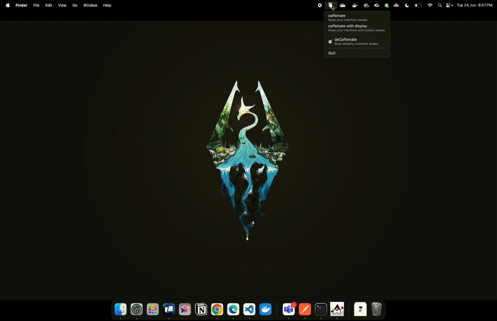

# Owl Coffee

Owl Coffee is a simple, fast, and easy-to-use app to keep your mac awake.

<div align="center" width="100%">
     
</div>

Built with [Electron](https://www.electronjs.org/) it taps into the high-level commands supported by the mac operating system to prevent it from going to sleep, with an option to keep the display awake.

All with the convinence of system tray options.

## Application Demo



## Installation

To install Owl Coffee, you can download the latest release from the [releases page](https://github.com/KiritoCyanPine/owl-coffee/releases).

You can also build the app from source by following the instructions in the [Building and Running](#building-and-running) section.

## Features

- Keep your machine awake
- Keep your display awake
- Interface with system tray options

## Building and Running

To build the app, you need to have [Node.js](https://nodejs.org/) installed. Once you have Node.js, you can clone the repository and run the following commands:

```bash
git clone
cd owl-coffee
npm install
npm run start
```
